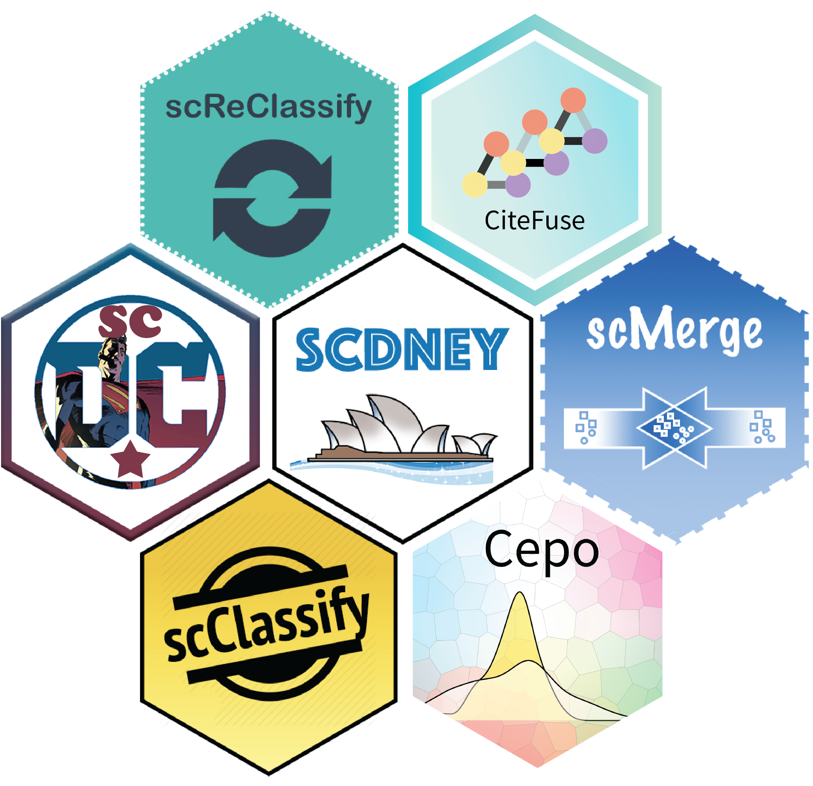

# scdney - Single cell data integrative analysis

<!--
<br />
-->


<!--
[](https://github.com/SydneyBioX/scdney/commits/master) [](https://travis-ci.org/SydneyBioX/scdney)


<br />

-->



<font size="+1">
`scdney` is a wrapper package with collection of single cell analysis R packages developed by team of **[Sydney Precision Bioinformatics Alliance](http://www.maths.usyd.edu.au/u/SMS/bioinformatics)** at The University of Sydney.
</font>

<font size="+1">
More information about the `scdney` package: https://sydneybiox.github.io/scdney/.
</font>


## Installation

+ To install all packages in available `scdney` and attached the installed `scdney` packages in the current R session.


```r
devtools::install_github("SydneyBioX/scdney")
library(scdney)
```
