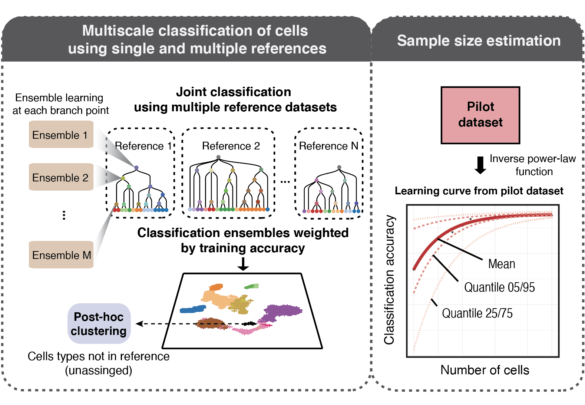
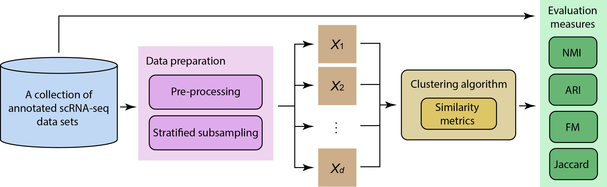
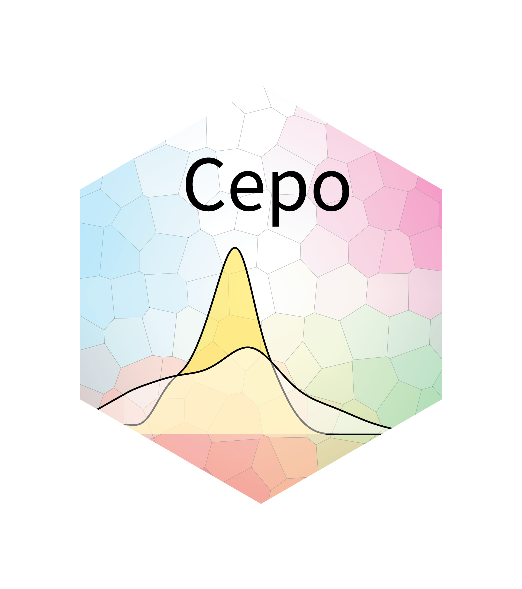

```{r setup, include=FALSE}
knitr::opts_chunk$set(echo = TRUE)
```

<font size="+1">
`scdney` include the packages for single-cell data analysis for data integration ([scMerge](https://github.com/SydneyBioX/scMerge)), cell type identification ([scClust](https://taiyunkim.github.io/scClustBench), [scClassify](https://github.com/SydneyBioX/scClassify), [scReClassify](https://github.com/SydneyBioX/scReClassify)), multi-modal data analysis ([CiteFuse](https://github.com/SydneyBioX/scReClassify)), higher order testing ([scHOT](https://github.com/shazanfar/scHOT)), differential stable genes analysis ([Cepo](https://github.com/PYangLab/Cepo)) and differential composition analysis ([scDC](https://github.com/SydneyBioX/scDC)).
</font>


## **Data integration**

### **scMerge**

<div class="row">
  <div class="col-md-7" markdown="1">
  Single-cell RNA-sequencing (scRNA-seq) profiling has exploded in recent years and enabled new biological knowledge to be discovered at the single-cell level. Successful and flexible integration of scRNA-Seq datasets from multiple sources promises to be an effective avenue to obtain further biological insights. This study presents a comprehensive approach to integration for scRNA-seq data analysis. It addresses the challenges involved in successful integration of scRNA-seq datasets by using the knowledge of genes that appear not to change across all samples and a robust algorithm to infer pseudoreplicates between datasets. This information is then consolidated into a single-factor model that enables tailored incorporation of prior knowledge. The effectiveness of scMerge is demonstrated by extensive comparison with other approaches.
  </div>
  <div class="col-md-5" markdown="1">
  <!--  -->
  
  </div>
</div>

+ **Github**: https://github.com/SydneyBioX/scMerge
+ **Reference**: Lin, Y., Ghazanfar, S., Wang, K.Y., Gagnon-Bartsch, J.A., Lo, K.K., Su, X., Han, Z.G., Ormerod, J.T., Speed, T.P., Yang, P. and Yang, J.Y.H. (2019) scMerge leverages factor analysis, stable expression, and pseudoreplication to merge multiple single-cell RNA-seq datasets. *Proceedings of the National Academy of Sciences*.


## **Cell type identification**

### **scClassify**


  <!--  -->
 
Automated cell type identification is a key computational challenge in single‐cell RNA‐sequencing (scRNA‐seq) data. To capitalise on the large collection of well‐annotated scRNA‐seq datasets, we developed scClassify, a multiscale classification framework based on ensemble learning and cell type hierarchies constructed from single or multiple annotated datasets as references. scClassify enables the estimation of sample size required for accurate classification of cell types in a cell type hierarchy and allows joint classification of cells when multiple references are available. We show that scClassify consistently performs better than other supervised cell type classification methods across 114 pairs of reference and testing data, representing a diverse combination of sizes, technologies and levels of complexity, and further demonstrate the unique components of scClassify through simulations and compendia of experimental datasets. Finally, we demonstrate the scalability of scClassify on large single‐cell atlases and highlight a novel application of identifying subpopulations of cells from the Tabula Muris data that were unidentified in the original publication. Together, scClassify represents state‐of‐the‐art methodology in automated cell type identification from scRNA‐seq data.

+ **Github**: https://github.com/SydneyBioX/scClassify
+ **Reference**: Lin, Y., Cao, Y., Kim, H.J., Salim, A., Speed, T., Lin, D.M., Yang, P. and Yang, J.Y.H. (2020) scClassify: sample size estimation and multiscale classification of cells using single and multiple reference. *Molecular Systems Biology*. 


### **scReClassify**


  Single-cell RNA-sequencing (scRNA-seq) is a fast emerging technology allowing global transcriptome profiling on the single cell level. Cell type identification from scRNA-seq data is a critical task in a variety of research such as developmental biology, cell reprogramming, and cancers. Typically, cell type identification relies on human inspection using a combination of prior biological knowledge (e.g. marker genes and morphology) and computational techniques (e.g. PCA and clustering). Due to the incompleteness of our current knowledge and the subjectivity involved in this process, a small amount of cells may be subject to mislabelling.
Here, we propose a semi-supervised learning framework, named scReClassify, for ‘post hoc’ cell type identification from scRNA-seq datasets. Starting from an initial cell type annotation with potentially mislabelled cells, scReClassify first performs dimension reduction using PCA and next applies a semi-supervised learning method to learn and subsequently reclassify cells that are likely mislabelled initially to the most probable cell types. By using both simulated and real-world experimental datasets that profiled various tissues and biological systems, we demonstrate that scReClassify is able to accurately identify and reclassify misclassified cells to their correct cell types.
scReClassify can be used for scRNA-seq data as a post hoc cell type classification tool to fine-tune cell type annotations generated by any cell type classification procedure. 


+ **Github**: https://github.com/SydneyBioX/scReClassify
+ **Reference**: Kim, T., Lo, K., Geddes, T., Kim, H.J., Yang, J.Y.H. & Yang, P. (2019) scReClassify: post hoc cell type classification of single-cell RNA-seq data. *BMC Genomics*.


### **scClust**


  Advances in high-throughput sequencing on single-cell gene expressions have enabled transcriptome profiling on individual cells from complex samples. A common goal in scRNA-seq data analysis is to discover and characterise cell types, typically through clustering methods. The quality of the clustering therefore plays a critical role in biological discovery. While numerous clustering algorithms have been proposed for scRNA-seq data, fundamentally they all rely on a similarity metric for categorising individual cells. Although several studies have compared the performance of various clustering algorithms for scRNA-seq data, currently there is no benchmark of different similarity metrics and their influence on scRNA-seq data clustering. Here, we compared a panel of similarity metrics on clustering a collection of annotated scRNA-seq datasets. Within each dataset, a stratified subsampling procedure was applied and an array of evaluation measures was employed to assess the similarity metrics. This produced a highly reliable and reproducible consensus on their performance assessment. Overall, we found that correlation-based metrics (e.g. Pearson’s correlation) outperformed distance-based metrics (e.g. Euclidean distance). To test if the use of correlation-based metrics can benefit the recently published clustering techniques for scRNA-seq data, we modified a state-of-the-art kernel-based clustering algorithm (SIMLR) using Pearson’s correlation as a similarity measure and found significant performance improvement over Euclidean distance on scRNA-seq data clustering. These findings demonstrate the importance of similarity metrics in clustering scRNA-seq data and highlight Pearson’s correlation as a favourable choice. Further comparison on different scRNA-seq library preparation protocols suggests that they may also affect clustering performance. 


+ **Github**: https://taiyunkim.github.io/scClustBench
+ **Reference**: Kim, T., Chen, I., Lin, Y., Wang, A., Yang, J.Y.H. and Yang, P. (2018) Impact of similarity metrics on single-cell RNA-seq data clustering. *Briefings in Bioinformatics*.


## **Multi-modal data analysis**

### **CiteFuse**


  <!--  -->
 
 Multi-modal profiling of single cells represents one of the latest technological advancements in molecular biology. Among various single-cell multi-modal strategies, cellular indexing of transcriptomes and epitopes by sequencing (CITE-seq) allows simultaneous quantification of two distinct species: RNA and cell-surface proteins. Here, we introduce CiteFuse, a streamlined package consisting of a suite of tools for doublet detection, modality integration, clustering, differential RNA and protein expression analysis, antibody-derived tag evaluation, ligand–receptor interaction analysis and interactive web-based visualization of CITE-seq data. We demonstrate the capacity of CiteFuse to integrate the two data modalities and its relative advantage against data generated from single-modality profiling using both simulations and real-world CITE-seq data. Furthermore, we illustrate a novel doublet detection method based on a combined index of cell hashing and transcriptome data. Finally, we demonstrate CiteFuse for predicting ligand–receptor interactions by using multi-modal CITE-seq data. Collectively, we demonstrate the utility and effectiveness of CiteFuse for the integrative analysis of transcriptome and epitope profiles from CITE-seq data.


+ **Github**: https://github.com/SydneyBioX/CiteFuse
+ **Reference**:  Kim, H.J., Lin, Y., Geddes, T.A., Yang, J.Y.H. and Yang, P. (2020) CiteFuse enables multi-modal analysis of CITE-seq data. *Bioinformatics*.


## **Cell marker detection**

### **Cepo**


  <!--  -->
 
Defining the identity of a cell is fundamental to understand the heterogeneity of cells to various environmental signals and perturbations. We present Cepo, a new method to explore cell identities from single-cell RNA-sequencing data using differential stability as a new metric to define cell identity genes. Cepo computes cell-type specific gene statistics pertaining to differential stable gene expression.


+ **Github**: https://github.com/PYangLab/Cepo
+ **Reference**:  Kim, H.J., Wang, K., Chen, C., Lin, Y., Tam, P., Lin, D., Yang, J.Y.H. and Yang, P. (2020) Cepo uncovers cell identity through differential stability. *bioRxiv*.

